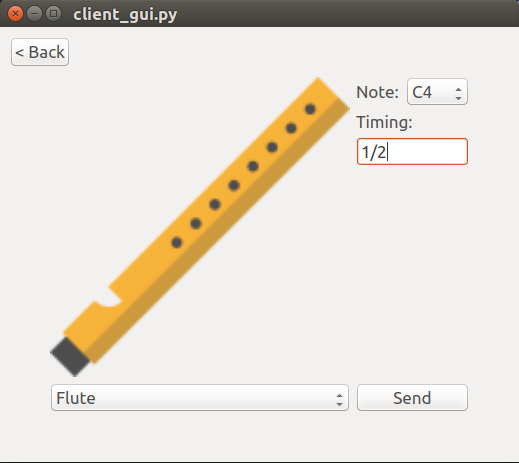
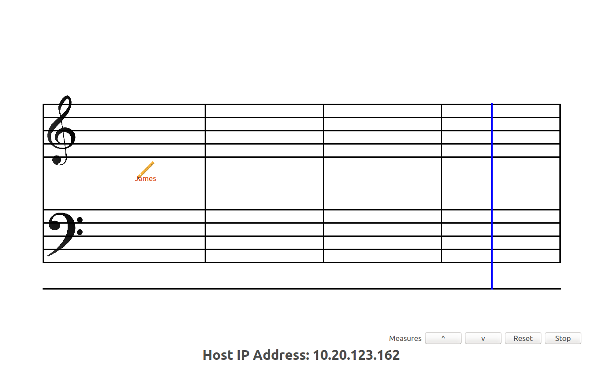

# sound-connect-py

Sound connect is a collaborative music environment written in Python2 and PyQt4.
I have created for tutorial facilitaiton in a course at ANU. The most of the code
is written over a weekend so there are some bad coding practices and small few bugs.
It utilizes SuperCollider and Foxdot.

## Images

 

## Setting up
Make sure all computers are on the same network.

### Client side setup
Download executable files from the links below.
- Linux: https://goo.gl/PJmE1n (28MB)
- Mac: https://goo.gl/KrN1ar (15MB)
- Windows: https://goo.gl/D14K1Y (14MB)

Executables are created with pyinstaller.
For Mac and Linux, make sure to make the file executable by `chmod`.
Timing field takes input of comma separated values. Takes fractions and decimal inputs. 
Example: `1/4,2/4,3/4` or `0.25, 0.5, 0.75`
### Host side setup
There is no executable files for host side, which means the host need to install dependencies.
Dependencies to install
- Python2
- PyQt4
  - For Windows, recommend using pip.
- [SuperCollider](http://supercollider.github.io/)
- [FoxDot](http://foxdot.org/)

Call `sudo python host.py` or `gksudo python host.py`. The second option is more preferred.
